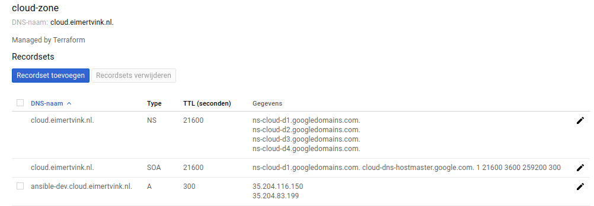
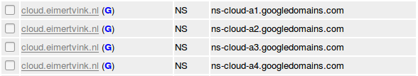

# terraform-google-dns-managed-zone

Create a DNS managed zone on Google Cloud.<br>

## Usage

1. Create a new directory for this terraform configuration.
2. Create a main.tf, for example:
```bash
# Configure the Google Cloud provider
provider "google" {
  credentials = "${file("king-of-my-google-cloud-castle.json")}"
  project     = "smashing-dash-1992"
}

module "google-dns-managed-zone" {
  source          = "github.com/Eimert/terraform-google-dns-managed-zone"

  dns_name        = "cloud-zone"
  dns_zone        = "cloud.eimertvink.nl."
}
```
3. ```terraform init```
4. ```terraform plan``` Boom! Credentials file missing.
5. Add your google cloud credentials in a .json file. [Getting started guide](https://www.terraform.io/docs/providers/google/getting_started.html#adding-credentials)

> Keep the Google Cloud credentials in a safe place. Don't push them to Git.

6. Adapt the Terraform variables in `main.tf` to match your Google cloud project name, and VM requirements. All optional parameters can be found in [variables.tf](./variables.tf).
5. Let terraform fire up the VM's:
```bash
terraform apply
```
6. Wait a few ~~minutes~~ seconds.
7. Optionally see the created resources in [Google Cloud Console](https://console.cloud.google.com/net-services/dns/zones/)
8. Break down the resources:
```bash
terraform destroy
```

## VM + DNS A record

This module can be used to register a type A (name) DNS record, linking a DNS name to a VM ip address. Terraform usage example in [github.com/Eimert/terraform-google-compute-engine-instance](https://github.com/Eimert/terraform-google-compute-engine-instance).

## DNS Managed Zone

Result in google cloud console, after running the example (minus the A record):
<br>

My personal domain [eimertvink.nl](http://eimertvink.nl/) is configured with NS of [freedns](https://freedns.afraid.org). This terraform plan configures Google Cloud to act as the NS for the subdomain cloud.eimertvink.nl.<br>

But that's not all. Freedns must forwards dns queries to \*.cloud.eimertvink.nl to Google's NS.
This is the configuration of freedns:<br>
<br><br>
Now the subdomain cloud.eimertvink.nl is configured to forward queries to Google' nameservers. And Google Cloud is providing DNS for queries to resources under \*.cloud.eimertvink.nl.

